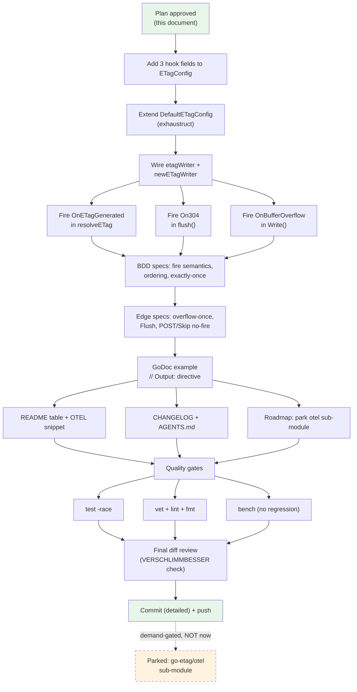

# OTEL-Ready Observability Hooks — Execution Plan

_Date: 2026-08-16 08:21 · Scope: core hooks only, `go-etag/otel` sub-module parked as demand-gated_

---

## 1. Context & Problem

go-etag has zero telemetry surface. The only observability hook is
`ETagConfig.OnError func(*errorfamily.Error)` (fired on post-commit write
failures). Users running OpenTelemetry, Prometheus, or structured logging
cannot see the events that actually matter for an ETag middleware:

- **Cache hit (304)** — the single most valuable metric: hit ratio.
- **ETag generated** — the denominator of that ratio.
- **Buffer overflow** — responses silently degrading to streaming (no ETag).

Design constraint (locked in discussion 2026-08-16): the core stays
**zero-telemetry-dependency**. Depguard allows only `$gostd`, `$module`, and
`go-error-family`. The idiomatic path is **lifecycle hook callbacks** that any
telemetry backend can consume in ~10 lines. An optional `go-etag/otel`
sub-module (own `go.mod`, OTEL API-only) is **parked until a consumer asks**
— a telemetry wrapper with zero consumers is speculative surface area
(see §6 Parked).

Related prior art in repo: status report
`docs/status/2026-08-07_07-00_typed-errors-overhaul.md` item #23 already
proposed exactly this ("metrics integration hooks beyond OnError").

## 2. Locked Design Decisions

| Decision                    | Choice                                                                                                                               | Rationale                                                                                                                                                                                           |
| --------------------------- | ------------------------------------------------------------------------------------------------------------------------------------ | --------------------------------------------------------------------------------------------------------------------------------------------------------------------------------------------------- |
| API shape                   | Three flat config fields, matching existing `OnError` style                                                                          | House style; discoverable; no ceremony for "just count 304s" users.                                                                                                                                 |
| Field signatures            | `OnETagGenerated func(ETag)`, `On304 func(ETag)`, `OnBufferOverflow func(int)`                                                       | Single-datum payloads. A unified `OnEvent func(Event)` union struct would carry impossible states (overflow event with meaningless ETag field) — violates "make impossible states unrepresentable". |
| `OnETagGenerated` honesty   | Fires **only** when the middleware **computes** a tag from body content. Handler-provided tags under `SkipIfPresent` do NOT fire it. | Name must not lie ("generated" ≠ "adopted"). SkipIfPresent users have handler-side knowledge already.                                                                                               |
| `On304` semantics           | Fires after the 304 status is committed, **in addition to** `OnETagGenerated` (which fired during resolve). Ordering documented.     | Hit + generation are both real events; consumers dedupe if needed.                                                                                                                                  |
| `OnBufferOverflow` payload  | The configured `MaxBufferSize` limit that was exceeded.                                                                              | Only datum the consumer may not have at hand; fires exactly once per response (flushed flag guarantees single transition).                                                                          |
| Handler-initiated `Flush()` | Does **not** fire `OnBufferOverflow`.                                                                                                | Handler streaming is a choice, not a limit breach.                                                                                                                                                  |
| Nil hooks                   | Zero cost: `if hook != nil` guard, no allocation, no interface.                                                                      | Hot path must stay allocation-free.                                                                                                                                                                 |
| Panic policy                | No `recover` around hooks.                                                                                                           | `net/http` already isolates handler-goroutine panics per connection. Documented.                                                                                                                    |
| Breaking-change policy      | Payload signatures may gain fields pre-1.0 (e.g. body length on 304) as minor-version breaking changes.                              | Library is 0.x; documented in README.                                                                                                                                                               |

## 3. Pareto Breakdown

### The 1% that delivers 51%

**The three hook fields + firing at the three existing code sites in `etag.go`.**
~40 lines changed, zero new files. After this alone, any consumer can count
304s, generations, and overflows and wire them to OTEL/Prometheus/slog.

### The 4% that delivers 64%

**BDD spec tests proving the event contract**: exactly-once firing, ordering,
nil-safety, and the no-fire paths (`Skip`, non-GET/HEAD, `SkipIfPresent`
adoption). Consumers can then trust the hooks as a stable contract.

### The 20% that delivers 80%

**Documentation + example + quality gates**: README config table + OTEL wiring
snippet, runnable GoDoc example, CHANGELOG entry, AGENTS.md update, roadmap
parking note, and the full gate suite (`go test -race`, vet, golangci-lint,
fmt, bench) staying green.

### The other 80% for the final 100% (deliberately deferred)

`go-etag/otel` sub-module (demand-gated) · bytes-saved datum on `On304` ·
hash-duration timing hook · `OnSkipped` event for `Skip`/method passthrough ·
slog integration recipe · If-Modified-Since support · integration test with
real `net/http` server (status report #27) · `OnError` for `WriteHeader`
failures (status report #22).

## 4. Comprehensive Plan (medium granularity, 30–100 min)

Sorted by importance / impact / effort / customer value.

| # | Task                                                                                                                    | Impact | Effort | Est (min) | Risk                                           |
| - | ----------------------------------------------------------------------------------------------------------------------- | ------ | ------ | --------- | ---------------------------------------------- |
| 1 | Implement 3 hook fields, wire `etagWriter`, fire at `resolveETag` / 304 branch / overflow branch in `etag.go`           | 10     | 3      | 60        | Signature mistakes baked into public API       |
| 2 | BDD specs: fire semantics, ordering, exactly-once, nil-safe, SkipIfPresent honesty                                      | 9      | 3      | 60        | Subtle double-fire bugs slipping through       |
| 3 | Edge specs: overflow fires once then streams, handler `Flush()` does not fire, POST/`Skip` never fire                   | 8      | 2      | 30        | None — pure test code                          |
| 4 | Full quality gates: `go test -race ./...`, `go vet`, `golangci-lint run`, `golangci-lint fmt`, bench                    | 8      | 2      | 30        | exhaustruct/wsl_v5 churn on struct literals    |
| 5 | README: 3 config-table rows + OTEL wiring snippet + hook semantics section                                              | 7      | 2      | 30        | Docs drift from code                           |
| 6 | GoDoc `ExampleNew_observabilityHooks` with `// Output:` (testableexamples)                                              | 6      | 1      | 30        | Flaky output if ordering underdetermined       |
| 7 | CHANGELOG `[Unreleased]` + AGENTS.md (config fields, non-obvious behaviors) + roadmap parking entry for otel sub-module | 6      | 1      | 30        | None                                           |
| 8 | Write this plan file, then `git status` → detailed commit → push                                                        | 5      | 1      | 30        | Push of unreviewed work (explicitly requested) |

## 5. Fine-Grained Breakdown (max 12 min per task)

Sorted by importance / impact / effort / customer value.

| #  | Task                                                                                                        | Belongs to | Est (min) |
| -- | ----------------------------------------------------------------------------------------------------------- | ---------- | --------- |
| 1  | Add 3 documented fields to `ETagConfig` (godot comments, `On304` ordering note)                             | 1          | 10        |
| 2  | Extend `DefaultETagConfig()` with the 3 nil fields (exhaustruct)                                            | 1          | 4         |
| 3  | Extend `etagWriter` struct + `newETagWriter` literal with 3 hook fields                                     | 1          | 8         |
| 4  | Fire `OnETagGenerated` in `resolveETag` after `Header().Set` (computed branch only)                         | 1          | 6         |
| 5  | Fire `On304` in `flush()` after `WriteHeader(304)`                                                          | 1          | 6         |
| 6  | Fire `OnBufferOverflow(limit)` in `Write()` overflow branch, before `Flush()`                               | 1          | 6         |
| 7  | Spec: 200 response fires `OnETagGenerated` exactly once with correct tag                                    | 2          | 10        |
| 8  | Spec: If-None-Match match fires `OnETagGenerated` + `On304`, in that order                                  | 2          | 10        |
| 9  | Spec: nil hooks change nothing (control test, body/etag identical)                                          | 2          | 8         |
| 10 | Spec: `SkipIfPresent` + handler tag fires neither hook                                                      | 2          | 10        |
| 11 | Spec: overflow fires `OnBufferOverflow` exactly once, later writes silent                                   | 3          | 12        |
| 12 | Spec: handler `Flush()` mid-handler does NOT fire overflow                                                  | 3          | 8         |
| 13 | Spec: POST and `Skip=true` fire nothing                                                                     | 3          | 8         |
| 14 | Spec: HEAD request still fires `OnETagGenerated`                                                            | 3          | 6         |
| 15 | Write `ExampleNew_observabilityHooks` with deterministic `// Output:`                                       | 6          | 12        |
| 16 | README: 3 rows in config table                                                                              | 5          | 6         |
| 17 | README: OTEL wiring snippet (~15 LOC, otel API-only, in a details block)                                    | 5          | 10        |
| 18 | CHANGELOG `[Unreleased] → Added`: 3 hook entries                                                            | 7          | 6         |
| 19 | AGENTS.md: extend config field list + 3 non-obvious-behavior bullets                                        | 7          | 10        |
| 20 | Roadmap: add "Parked: `go-etag/otel` sub-module" with demand-gate rationale to `docs/review-and-roadmap.md` | 7          | 8         |
| 21 | `go build ./...` + `go test ./...` (fast loop after each code task)                                         | 4          | 6         |
| 22 | `go test -race ./...`                                                                                       | 4          | 6         |
| 23 | `go vet ./...`                                                                                              | 4          | 4         |
| 24 | `golangci-lint run` → fix findings                                                                          | 4          | 12        |
| 25 | `golangci-lint fmt` → verify no diff                                                                        | 4          | 6         |
| 26 | `go test -bench=. ./...` (no regression in hot path)                                                        | 4          | 10        |
| 27 | Final review of full diff against plan (VERSCHLIMMBESSER check)                                             | 4          | 12        |
| 28 | Plan file polish + mermaid graph verify                                                                     | 8          | 8         |
| 29 | `git status` + detailed commit                                                                              | 8          | 8         |
| 30 | `git push` (explicitly requested)                                                                           | 8          | 2         |

## 6. Parked (NOT in this plan — demand-gated)

**`go-etag/otel` sub-module.** Own `go.mod` at `./otel`, depguard exception for
`go.opentelemetry.io/otel` **API only** (never the SDK — consumers keep their
SDK choice). Single entry `otel.Middleware(cfg, opts...)` wrapping `etag.New`,
emitting `etag_hits_total`, `etag_misses_total`, `etag_buffer_overflows_total`,
hash-duration histogram. Prereqs: (a) hooks shipped and battle-tested, (b) at
least one real consumer asks for it, (c) acceptance of a second release track
(path-scoped tags `otel/vX.Y.Z` — mis-tagging poisons the module proxy), (d) a
`go.work` for local dual-module testing.

## 7. Execution Graph

## 8. Verification Checklist (definition of done)

- [x] `go test ./...` green, new specs included
- [x] `go test -race ./...` green (mandatory: all tests `t.Parallel()`)
- [x] `go vet ./...` clean
- [x] `golangci-lint run` 0 issues (exhaustruct, wsl_v5, mnd, godot, paralleltest…)
- [x] `golangci-lint fmt` produces no diff
- [x] `go test -bench=. ./...` shows no hot-path regression
- [x] README, CHANGELOG, AGENTS.md, roadmap consistent with the code
- [x] Public API additions documented; no dependency added
- [x] Detailed commit pushed (explicitly requested)
