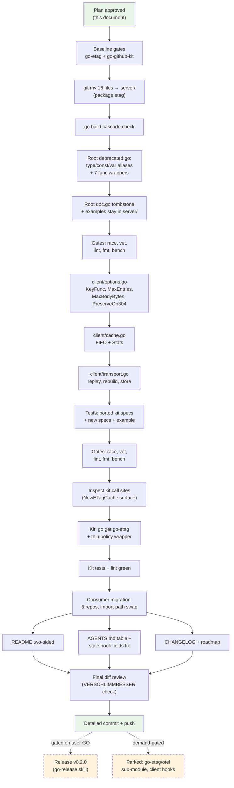

# go-etag Two-Sided Library: server/ + client/ Split with Deprecated Root Shim — Master Plan

_Date: 2026-08-16 08:35 · Scope: go-etag restructure, `client` package extraction, go-github-kit refactor, consumer migration, docs_
_Related: [`2026-08-16_08-21_otel-observability-hooks.md`](./2026-08-16_08-21_otel-observability-hooks.md) — **executed** (`OnETagGenerated`/`On304`/`OnBufferOverflow` live in `etag.go:67-88`); this plan carries them into `server/` unchanged and fixes the stale AGENTS.md field list that plan left behind._

---

## 1. Context & Problem

go-etag is server-only middleware. Client-side conditional-GET caching exists as
~245 lines of generic mechanism welded to GitHub policy in
`go-github-kit/etag.go` (auth-scoped keys, `X-RateLimit-*` merge, branded
marker header). Every future API client (GitLab, Stripe, Kubernetes watchers)
would re-implement it. Meanwhile the root package path
`github.com/larsartmann/go-etag` is bound to "server" by **11 files across 5 of
Lars' own projects** (httputil, DiscordSync ×2, nsfw-classifier,
library-policy, cqrs-htmx example) and by published v0.1.1 docs — pkg.go.dev
shows 0 external importers, so the only breakage risk is in-house.

**Decision (locked in discussion 2026-08-16):** hollow the root into a
deprecated alias shim, move all server code to `server/`, extract a generic
`client/` package, refactor go-github-kit onto it. The shim keeps every
existing import compiling while staticcheck nudges consumers to migrate.
Cheapest now (pre-v1, 0 external importers); impossible after v1.

## 2. Locked Design Decisions

| Decision | Choice | Rationale |
| --- | --- | --- |
| Module layout | **One go.mod**: root shim + `server/` + `client/` | Zero shared code between sides justifies no extra modules; one release track; no proxy-poisoning risk from path-scoped tags. |
| Root package | Deprecated alias shim only; **deleted at v1.0.0** | Non-breaking migration path; type/const/var aliases are true aliases, funcs get one-line wrappers (Go has no function aliases). |
| `server/` package name | `etag` (package name ≠ dir) | Consumer migration = pure import-path swap; zero call-site changes; `etag.New` reads identically. |
| `client/` package name | `etagclient` | Collision-free at call sites (`etagclient.NewTransport`); matches house preference for self-documenting package names. |
| Client cache | Hand-rolled map + order-slice FIFO (port from kit) | ≤256 entries, ops amortized against multi-ms RTT; otter v2 payoff cannot manifest; depguard forbids it in root module anyway. |
| Client `KeyFunc` | Hook, nil = `req.URL.String()` | Credential scoping is **policy** (kit passes `authKey`). Doc comment must warn loudly: responses varying by Authorization REQUIRE a credential-scoped KeyFunc. |
| Client `MaxBodyBytes` | Clamp `<= 0` to 1 MiB (matches server `MaxBufferSize` posture) | Silent unbounded body caching is a footgun; oversized responses pass through uncached. Kit overrides explicitly. |
| Client `PreserveOn304` | Default `["Date"]` | RFC 7232 §4.1: 304 carries fresh Date; rebuilt 200 must not wear a stale one. Kit adds `X-RateLimit-*`/`Retry-After`. |
| Client `FromCacheHeader` | Default `""` (disabled) | Branded marker is kit policy (`X-Github-Kit-From-Cache`). |
| Client constructor | `NewTransport(next http.RoundTripper, opts Options) *Transport` + `Stats()` | One object, no nil-cache impossible state; embedded cache; kit's public `NewETagCache`/`ETagStats` surface stays stable via a thin wrapper. |
| Consumer migration | Import-path swap only (package name identical) | 11 files, 5 repos, mechanical; deprecation warnings are advisory so nothing blocks. |
| OTEL | Hooks already shipped; move with `server/` untouched. Parked `go-etag/otel` sub-module stays demand-gated (see otel plan §6). | No client hooks yet — `Stats()` suffices until a consumer asks. |
| Release | v0.2.0 tag after all green — **gated on explicit user GO** (go-release skill governs) | Shim makes it non-breaking; single tag covers all three paths. |

## 3. Pareto Breakdown

### The 1% that delivers 51%

**`git mv` 16 files into `server/` + the ~90-line root deprecated shim.**
Mechanical, ~1.5 h. After this alone the two-sided layout exists, every
existing consumer still compiles, and the module path story is settled
forever.

### The 4% that delivers 64%

**The `client/` package itself**: Options + FIFO cache + conditional-GET
transport + ported tests. The actual new capability every future API client
imports.

### The 20% that delivers 80%

**go-github-kit refactored onto `client/`** (the one real consumer proves the
extraction; policy hooks = the three already-hardcoded bits) **+ full quality
gates on both repos.**

### The other 20% to reach 100% (deliberately included, lower urgency)

Consumer migration (11 files / 5 repos) · README + AGENTS.md rewrite (incl.
stale hook-field fix) · CHANGELOG · GoDoc examples · parked-notes re-pointing ·
plan-file commit/push · v0.2.0 release (user-gated).

## 4. Comprehensive Plan (medium granularity, 30–100 min)

Sorted by importance / impact / effort / customer value.

| # | Task | Impact | Effort | Est (min) | Risk |
| - | ---- | ------ | ------ | --------- | ---- |
| 1 | **server/ move + root deprecated shim**: `git mv` all 16 .go files → `server/` (package stays `etag`), root `deprecated.go` (4 type aliases, 7 consts, 1 var, 7 func wrappers, all `// Deprecated:`), root `doc.go` tombstone, examples moved to server | 10 | 6 | 90 | Missed export in shim; doc drift |
| 2 | Gates after restructure: `go test -race ./...`, vet, lint, fmt, bench — plus fix AGENTS-known linter fallout | 9 | 3 | 30 | exhaustruct/wsl_v5 churn |
| 3 | **client/ package**: `doc.go`, `options.go` (KeyFunc/MaxEntries/MaxBodyBytes/PreserveOn304/FromCacheHeader + normalization), `cache.go` (FIFO + Stats), `transport.go` (RoundTrip, If-None-Match replay, 304→200 rebuild, store with body re-read + size skip) | 10 | 7 | 90 | API shape baked in wrong |
| 4 | **client/ tests**: port kit's `etag_test.go` (223 lines) + new specs (KeyFunc default/custom, PreserveOn304, FromCacheHeader, MaxBodyBytes skip, non-GET passthrough, store-failure passthrough, FIFO eviction, race-safe Stats) + GoDoc example with `// Output:` | 9 | 6 | 90 | Subtle 304-merge semantics |
| 5 | Gates for client: race, vet, lint, fmt, bench | 8 | 2 | 30 | paralleltest/thelper misses |
| 6 | **go-github-kit refactor**: inspect kit call sites of `NewETagCache`/`ETagOptions`/`ETagStats`, `go get github.com/larsartmann/go-etag`, rewrite `etag.go` as thin policy wrapper (authKey KeyFunc, rate-limit PreserveOn304, branded marker, explicit MaxBodyBytes), update the now-false "not a dependency here" doc comment | 9 | 4 | 60 | Public kit API drift |
| 7 | Kit gates: tests, race, its lint setup | 8 | 2 | 30 | ginkgo suite coupling |
| 8 | Docs: README two-sided rewrite (quickstarts/config/install/bench paths), AGENTS.md (architecture table server/client/shim + add missing hook fields), CHANGELOG `[Unreleased]`, roadmap parked-note re-point | 7 | 3 | 60 | Docs/code drift |
| 9 | Consumer migration: httputil, DiscordSync ×2, nsfw-classifier, library-policy, cqrs-htmx — import-path swap, build, test, commit per repo | 6 | 4 | 60 | Unexpected direct symbol use |
| 10 | Final review of full diff vs plan (VERSCHLIMMBESSER check) | 6 | 2 | 30 | Scope creep sneaks in |
| 11 | Write this plan file + detailed commit + push (plan only) | 5 | 1 | 30 | Push of unreviewed work (requested) |
| 12 | *(Gated on user GO)* Release v0.2.0 per go-release skill: CHANGELOG cut, tag, push, pkg.go.dev verify | 8 | 3 | 30 | Tag/proxy mistakes |

## 5. Fine-Grained Breakdown (max 12 min per task)

Sorted by importance / impact / effort / customer value within execution order.

| #  | Task | Phase | Est (min) |
| -- | ---- | ----- | --------- |
| 1  | Baseline: clean tree check, `go build` + `go test -race ./...` green in go-etag and go-github-kit | A | 10 |
| 2  | `git mv` all 16 `.go` files (incl. tests, fuzz, example) → `server/` | A | 4 |
| 3  | `go build ./...` — cascade check, fix fallout (memory rule: build immediately after moves) | A | 6 |
| 4  | Root `deprecated.go`: 4 type aliases (`ETag`, `ETagConfig`, `Middleware`, `Strength`) with `// Deprecated:` docs | A | 10 |
| 5  | Root: 7 const aliases (`Strong`, `Weak`, 5× `ErrCode*`) + `var ErrInvalidConfig` | A | 8 |
| 6  | Root: 7 func wrappers (`New`, `DefaultETagConfig`, `ParseETag`, `ParseETagList`, `MatchesIfMatch`, `MatchesIfNoneMatch`, `RegisterErrorClassifications`) | A | 10 |
| 7  | Root `doc.go`: tombstone package doc + 3-line migration snippet | A | 8 |
| 8  | Verify example tests live only in `server/` (root examples would self-warn) | A | 6 |
| 9  | `go test -race ./...` after shim | A | 6 |
| 10 | vet + `golangci-lint run` + `golangci-lint fmt` on restructure | A | 10 |
| 11 | `client/doc.go`: package `etagclient` docs + KeyFunc credential warning | B | 8 |
| 12 | `client/options.go`: `Options` struct + `normalize()` (defaults 256 / 1 MiB / `["Date"]`) | B | 12 |
| 13 | `client/cache.go`: FIFO map+order cache, mutex, `Stats()` | B | 12 |
| 14 | `client/transport.go`: `NewTransport` + `RoundTrip` skeleton (GET gate, key, If-None-Match replay, passthrough) | B | 12 |
| 15 | `client/transport.go`: `rebuildFromCache` (header clone, PreserveOn304 merge, marker) + `store` (body read, size skip, re-readable body) | B | 12 |
| 16 | Port kit tests: 304 rebuild, cache store, eviction, stats | B | 12 |
| 17 | New specs: KeyFunc default vs custom, PreserveOn304 merge, FromCacheHeader set/absent | B | 12 |
| 18 | New specs: MaxBodyBytes skip, non-GET passthrough, 304-without-entry passthrough, store-failure passthrough | B | 10 |
| 19 | New specs: concurrent RoundTrip race coverage (race detector) | B | 10 |
| 20 | GoDoc `ExampleNewTransport` with deterministic `// Output:` | B | 10 |
| 21 | Gates: race, vet, lint, fmt, bench on client | B | 12 |
| 22 | Kit: read all call sites of `NewETagCache`/`ETagOptions`/`ETagStats` before touching anything | C | 8 |
| 23 | Kit: `go get github.com/larsartmann/go-etag` (path check: lowercase `larsartmann`) | C | 4 |
| 24 | Kit: rewrite `etag.go` as thin wrapper over `etagclient` (keep public surface stable) | C | 12 |
| 25 | Kit: rewrite the stale doc comment (now IS built on go-etag/client) | C | 6 |
| 26 | Kit: run tests + race + lint; fix drift (223-line test file should mostly survive) | C | 12 |
| 27 | httputil: import swap → `go-etag/server`, build, test, commit | D | 12 |
| 28 | DiscordSync (2 files): import swap, build, test, commit | D | 10 |
| 29 | nsfw-classifier + library-policy: import swap, build, test, commit each | D | 10 |
| 30 | cqrs-htmx example: import swap, build, commit | D | 8 |
| 31 | Sweep: confirm zero call-site edits beyond import lines (package name identical) | D | 4 |
| 32 | README: two-sided intro + both quickstarts | E | 12 |
| 33 | README: config tables, install paths, bench/table paths, deprecation notice | E | 10 |
| 34 | AGENTS.md: architecture table (`server/`, `client/`, root shim) **+ add missing `OnETagGenerated`/`On304`/`OnBufferOverflow` to ETagConfig field list (stale since otel plan)** | E | 12 |
| 35 | CHANGELOG `[Unreleased]`: Added `client`; Changed import path + deprecated root | E | 8 |
| 36 | Roadmap: re-point parked `go-etag/otel` note to new layout (`docs/review-and-roadmap.md`) | E | 6 |
| 37 | Full-diff review against this plan (VERSCHLIMMBESSER check) | E | 12 |
| 38 | Plan file polish + mermaid graph render check | E | 8 |
| 39 | `git status` + detailed commit(s) | E | 8 |
| 40 | `git push` | E | 2 |
| 41 | *(Gated)* v0.2.0 release: CHANGELOG cut, annotated tag, push, proxy + pkg.go.dev + `go get` verify | F | 12 |

## 6. Parked (NOT in this plan — demand-gated)

- **`go-etag/otel` sub-module** — unchanged from otel plan §6; prereqs now
  include the settled `server/` path (`otel.Middleware` wraps `etag/server`).
- **Client-side hooks** (`On304Hit`, `OnStore`) — `Stats()` covers the need
  until a consumer asks.
- **Root shim deletion** — scheduled for the v1.0.0 tag.
- **Otter v2** for the client cache — revisit only if a consumer measures
  contention at thousands of entries.

## 7. Execution Graph

## 8. Verification Checklist (definition of done)

- [ ] `go build ./...` green immediately after `git mv` (cascade caught early)
- [ ] `go test -race ./...` green across root, `server/`, `client/`
- [ ] `go vet ./...` clean; `golangci-lint run` 0 issues; `golangci-lint fmt` no diff
- [ ] `go test -bench=. ./...` shows no hot-path regression
- [ ] Root shim compiles standalone: a v0.1.1-style consumer (`etag.New`, `etag.ParseETag`, …) builds unchanged with deprecation warnings only
- [ ] All 9 v0.1.1 public exports + 3 OTEL hooks reachable via shim or `server/`
- [ ] go-github-kit tests green on refactored `etag.go`; public surface unchanged
- [ ] All 5 consumer repos build + test after import swap; diffs contain only import lines
- [ ] README, AGENTS.md (incl. hook fields), CHANGELOG, roadmap consistent with code
- [ ] Detailed commit(s) pushed (plan file now; code after review)
- [ ] *(Gated)* v0.2.0 tagged, proxy + pkg.go.dev verified

## 9. Risks

| Risk | Likelihood | Mitigation |
| ---- | ---------- | ---------- |
| Shim misses an export | Low | Enumerate against pkg.go.dev v0.1.1 index (captured in §1); compile-test a legacy-style consumer |
| Client API shape regret | Medium | Hook list = exactly the 3 hardcoded kit policies; nothing speculative |
| Kit public API drift | Medium | Task 22 reads call sites before rewrite; keep `NewETagCache`/`ETagOptions`/`ETagStats` stable |
| Consumer repos have uncommitted local state | Medium | Check `git status` per repo first; never touch foreign changes (auto-commit daemon active) |
| VERSCHLIMMBESSER | — | Task 37 full-diff review; shim deleted only at v1; parked list enforced |
