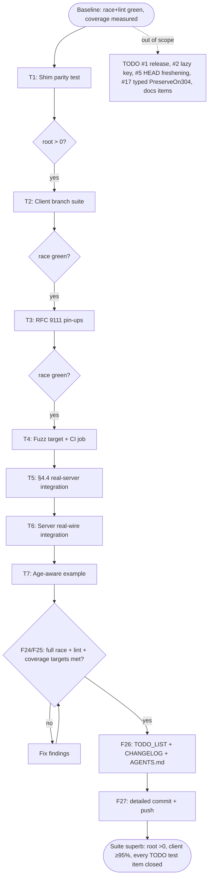

# Superb Test Hardening — Pareto Plan

_Created: 2026-09-11 00:25 · Session goal: "I WANT US TO HAVE SUPERB TESTS!"_

Baseline at planning time: server **99.0%**, client **94.3%**, root shim **0.0%** (8 exported
wrappers, zero test files). Every test item in `TODO_LIST.md` (#3, #6, #7, #8, #12, #14, #15, #18)
is in scope. Items that change behavior or API (#2 lazy key, #5 HEAD freshening, #17 typed
PreserveOn304) and doc items (#9, #10, #13, #16, #20, #21) are explicitly out of scope.

**BDD discipline without Ginkgo:** the `bdd-testing` skill's dependency (onsi/ginkgo + gomega)
violates this repo's `depguard` constraint and its own testing conventions ("plain testing, no
assertion libraries"). We adopt the skill's *method*: one behavior per spec, behavior-named
subtests that read as sentences, black-box assertions through the public API, no shared mutable
subjects, no committed focus — expressed in the project's native `t.Run` Describe/Context/It style.

## Pareto Breakdown

| Tier | Share of result | Items |
| --- | --- | --- |
| **1%** | 51% | Root shim parity test (whole package at 0%, parity can drift silently) + client branch tests for freshen skip-guard, store Close-error, validator edges |
| **4%** | +13% → 64% | RFC 9111 spec pin-ups (only-200-stored, no-store 304 rebuild, unsafe-method table, additive freshening, Age monotonicity) + client Cache-Control fuzz target with CI job |
| **20%** | +16% → 80% | §4.4 invalidation through a real server, server-side real-wire integration, Age-aware example |
| **Remaining** | → 100% | TODO items out of test scope (features/docs/release), listed for the next sessions |

## Comprehensive Plan (30–100 min tasks)

| # | Task | Effort | Impact | Why it matters |
| --- | --- | --- | --- | --- |
| T1 | Shim export-parity test (`deprecated_test.go`): compile-time type identity + behavior smoke through all 8 wrappers, consts, sentinel | 45m | High | Closes the only 0%-coverage package; pins the v0.x compatibility contract until v1.0.0 removal (TODO #14) |
| T2 | Client branch-coverage suite: `freshen` skip-guard, `store` Close-error branch, `weaklyMatchesValidator` edges, `mergeHeader` exact/canonical, `RoundTrip` (nil,nil) guard | 60m | High | The aggregate 94.3% hides the exact guards that protect data correctness under concurrency (TODO #7, #8) |
| T3 | RFC 9111 spec pin-ups in `spec_test.go`: only-200-stored table, no-store-carrying 304 still rebuilds, exhaustive `isUnsafeMethod` table, additive freshening persisted, Age monotonicity across N revalidations | 75m | High | Locks the remaining unpinned normative readings the reports flagged (TODO #12) |
| T4 | Client fuzz target `FuzzHasNoStoreDirective` (no-panic + soundness property) + CI fuzz job | 40m | High | `Cache-Control` is untrusted input parsed by hand; the server fuzzes, the client does not (TODO #3) |
| T5 | §4.4 invalidation integration via `httptest.Server` — PUT 200 then GET must refetch | 30m | Medium | Stub-only coverage today; wire reality is where canonicalization surprises live (TODO #6) |
| T6 | Server real-wire integration via `httptest.NewServer`: 200/304/HEAD framing, Content-Length, body suppression over TCP | 45m | Medium | Server tests are recorder-only; net/http framing behaviors are untested (TODO #15) |
| T7 | Age-aware client GoDoc example with Output | 30m | Low | Documents the field case's lesson (stale-at-the-edge detection) in the API surface (TODO #18) |
| T8 | Verification + living docs: race/lint/fmt, coverage targets (client ≥95%, root >0), TODO_LIST + CHANGELOG, detailed commits | 60m | High | No change counts unless the suite stays green and the backlog reflects reality |

## Fine-Grained Breakdown (≤12 min tasks)

| # | Task | Parent | Est |
| --- | --- | --- | --- |
| F1 | Read shim + server test helpers; draft parity assertions (type identity via `var _ server.ETag = DeprecatedETag{}`) | T1 | 10m |
| F2 | Write `deprecated_test.go`: consts, sentinel `errors.Is`, 8 wrapper smokes, middleware end-to-end | T1 | 12m |
| F3 | `go test ./...` + `go tool cover -func` → root >0, suite green | T1 | 4m |
| F4 | `cache_test.go`: freshen replaces matching entry; freshen skips on validator mismatch; freshen on absent key is inert | T2 | 12m |
| F5 | `transport_test.go`: store Close-error branch (body whose Close fails) keeps response re-readable | T2 | 10m |
| F6 | `transport_test.go`: `weaklyMatchesValidator` table (W/ vs bare vs lowercase w/ vs empty) | T2 | 8m |
| F7 | `transport_test.go`: `mergeHeader` exact-key hit + canonical fallback (non-canonical PreserveOn304 name) | T2 | 8m |
| F8 | `transport_test.go`: broken `next` returning (nil, nil) passes through without panic | T2 | 6m |
| F9 | `go test -race ./client` + coverage delta | T2 | 5m |
| F10 | `spec_test.go`: only-200-with-ETag stored (201/206/304/500 pass through unstored) | T3 | 10m |
| F11 | `spec_test.go`: 304 carrying no-store still rebuilds (stored 200 governs; 304 never stored) | T3 | 10m |
| F12 | `transport_test.go`: exhaustive `isUnsafeMethod` table (CONNECT, BREW, empty) | T3 | 6m |
| F13 | `spec_test.go`: additive freshening — 304-provided new field lands on rebuild AND stored entry | T3 | 10m |
| F14 | `spec_test.go`: Age monotonicity across 4 revalidations (never runs backwards) | T3 | 10m |
| F15 | `go test -race ./client` + review | T3 | 5m |
| F16 | Write `client/fuzz_test.go` with seeds + soundness property, mirror server fuzz doc style | T4 | 12m |
| F17 | Run seeds (`go test`), short live fuzz (`-fuzztime=20s`) locally | T4 | 6m |
| F18 | Add CI fuzz step for `./client/...` | T4 | 5m |
| F19 | Extend `client/integration_test.go`: real PUT invalidation round trip | T5 | 12m |
| F20 | Verify: server hit-count proves refetch, no conditional after invalidation | T5 | 8m |
| F21 | Write `server/integration_test.go`: real-server GET 200, conditional 304, HEAD framing | T6 | 12m |
| F22 | Assert 304 wire facts: empty body, no Content-Length, connection reusable | T6 | 10m |
| F23 | `client/example_test.go`: Age-aware example with deterministic stub + Output | T7 | 12m |
| F24 | Full `go test -race ./...` + `golangci-lint run` + `golangci-lint fmt` | T8 | 10m |
| F25 | Coverage audit vs targets; document intentionally-uncovered defensive branches | T8 | 10m |
| F26 | Re-read + update TODO_LIST (remove done), CHANGELOG [Unreleased], AGENTS.md testing notes | T8 | 12m |
| F27 | git status, detailed commit(s), push | T8 | 8m |

## Execution Graph

## Intentionally Uncovered (defensive, documented — not test debt)

- `server/etag.go` `defaultHashFunc` panic branch: `fnv.Write` cannot fail per the `hash.Hash`
  contract; the panic is unreachable without a broken stdlib.
- `client/transport.go` nil-header guards (`freshenedHeader`, `rebuiltHeader`, `persistFreshened`
  empty-ETag fallback): `store` always persists a cloned, ETag-bearing header, so the guards are
  unreachable through the public API.
- Annotated 2026-09-11 (§4.3.5 HEAD freshening session): `freshenFromHead`'s empty-ETag fallback
  joins the same class — the stored entry's header always carries the validator `store` cloned in,
  so the fallback is unreachable through the public API.
