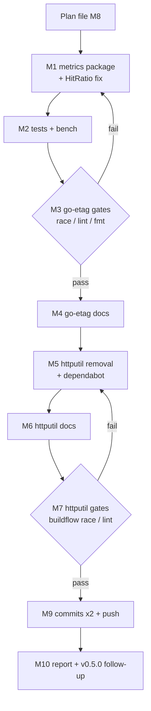

# Move `httputil/etagmetrics` → `go-etag/metrics`

**Date:** 2026-09-22 23:25 · **Status:** executed & verified (same day, ~23:45) · **Scope:** cross-repo (go-etag receives, httputil removes) · **Origin:** owner decision in httputil session 2026-09-22 ("A: subpackage `go-etag/metrics`, zero new release machinery")

## Outcome (filled in after execution)

- **go-etag:** `metrics/` package landed (`metrics.go`, `doc.go`, `metrics_test.go`, `bench_test.go`, `example_test.go` — the GoDoc example the auto-commit daemon contributed mid-move, carried over). Gates: `go test -race ./...` green (all 5 packages), `golangci-lint run` 0 issues, hook-overhead benchmark ~9 ns/op over the hook-less baseline. Content committed by the auto-commit daemon (`33914f1`, `5ae86e0`, `5b2d21e`, `8884b87`); this completion record is the deliberate commit.
- **httputil:** `etagmetrics/` deleted (daemon commit `ca3ec3f`), README/CHANGELOG/FEATURES move notes (`3288807`), dependabot `/etagmetrics` entry dropped (`6654e4c`). Race gate green via `buildflow -s test-race`; module lint 0 issues.
- **HitRatio fix shipped:** `NotModified / Generated` (was `NotModified / (Generated + NotModified)` — every 304 double-counted); correction of record in httputil `[Unreleased]`; the frozen v1.3.0 tag keeps the old copy (tags are never retagged).
- **Incidents during execution:** (1) the auto-commit daemon twice resurrected the deleted `httputil/etagmetrics/` from a stale snapshot; resolved by re-trashing — stable since 23:39:51, no history re-addition. (2) The daemon's dependabot write raced the first edit; re-applied and deliberately committed (`6654e4c`). (3) BuildFlow's `golangci-lint` step failed twice against the resurrected ghost module — noise, not a real finding; root module reported 0 issues throughout.
- **Follow-up (not executed here):** tag go-etag `v0.5.0` via the release runbook so consumers can `go get github.com/larsartmann/go-etag/metrics@v0.5.0` instead of a master pseudo-version.

## Problem

`httputil/etagmetrics` (module `github.com/larsartmann/httputil/etagmetrics`, shipped in httputil v1.3.0) turns go-etag's observability hooks (`OnETagGenerated`, `On304`, `OnBufferOverflow`) into atomic counters. It lives in the wrong repo:

1. **Cross-repo version coupling** — the adapter pins go-etag `v0.4.0` (where the hooks exist) while httputil root pins `v0.3.1`; the tag's `go 1.27.1` directive already forced a go-version dance in httputil (auto-commits `3c2ca13`, `11f6f7b` on 2026-09-22) and breaks gopls there ("go-etag@v0.4.0 requires go >= 1.27.1").
2. **Hook-coupling without co-location** — every hook signature change in go-etag requires a PR in a second repo.
3. **Philosophy mismatch** — go-etag's hooks are documented as "OTEL/Prometheus-ready without a telemetry dependency" (go-etag AGENTS.md); the natural companion to a seam lives next to the seam. httputil's own ROADMAP already rules that ETag scope lives in go-etag.
4. **Discoverability** — nobody adopting go-etag looks in httputil for its metrics helper.

## Decision (option table from the session)

| Option | Deps cost | Hook coupling | Release machinery | Verdict |
| --- | --- | --- | --- | --- |
| A. subpackage `go-etag/metrics` (same module, **chosen**) | zero — imports only `sync/atomic` + in-module `server` | atomic, same PR | none; ships with go-etag tags | best fit while no telemetry SDK dep exists |
| B. sub-module `go-etag/etagmetrics` (own go.mod) | core clean; allows future SDK deps | atomic | new tag cadence | extract later, the moment a Prometheus/OTEL SDK dep is actually needed |
| C. status quo in httputil | drift (v0.3.1 vs v0.4.0) | two repos per hook change | orphaned from the hooks it counts | rejected |

## Bug found during research: `HitRatio()` double-counts 304s

Shipped formula: `NM / (Generated + NM)` with the claim "the denominator counts every tag-computing response exactly once". Verified against go-etag source (`server/etag.go:60-81`):

- `On304` fires **in addition to** `OnETagGenerated` on a 304 with a computed tag → a 304 increments BOTH counters.
- Therefore `Generated` alone already counts every tag-computing response (200s and 304s); adding `NM` counts every 304 **twice**.
- Proof by shipped test: `TestAttach_CountsConditional304` observes `Generated=2, NotModified=1` after exactly 2 responses → true 304-share = 1/2, shipped ratio = 1/3.

**Fix (lands with the move):** `HitRatio() = NotModified / Generated`, `0` when `Generated == 0`, with a documented caveat: 304s on handler-adopted tags (`SkipIfPresent`) fire `On304` without `OnETagGenerated` and can push the ratio above 1 — for exact accounting across adopted tags, install a custom hook. httputil v1.3.0's tagged copy keeps the old formula (tags are immutable; the correction is recorded in httputil `[Unreleased]` and shipped in go-etag).

## Pareto breakdown

- **1% → 51%:** the `metrics/` package itself in go-etag (code + fixed HitRatio + adapted tests). Everything else is hygiene around it.
- **4% → 64%:** + the two repo loops (go-etag docs; httputil removal incl. dependabot `/etagmetrics` entry).
- **20% → 80%:** + verification gates (race tests, ~70-linter gate, formatter, bench sanity) in both repos.
- **remaining 20% → 100%:** plan doc, detailed commits + push, v0.5.0 tagging follow-up, GOTOOLCHAIN=auto discipline (go-etag AGENTS.md), dead `mustAttach` helper dropped, doc-snippet-refs non-impact check, final report.

## Medium-granularity plan (sorted by importance / impact / effort / customer value)

| # | Task | Impact | Effort | Est |
| --- | --- | --- | --- | --- |
| M1 | go-etag: create `metrics/` package — `Attach`/`Counters`/`Snapshot`, fixed `HitRatio`, rewritten `doc.go` (no httputil references) | Critical (the deliverable) | M | 45m |
| M2 | go-etag: adapt tests (`package metrics_test`, ratio 1/2, drop dead `mustAttach`) + benchmarks | Critical (correctness proof) | M | 40m |
| M3 | go-etag: formatter + `go test -race ./...` + `golangci-lint run` + bench sanity (`GOTOOLCHAIN=auto`) | Critical (gate) | S | 30m |
| M4 | go-etag: docs — README (Observability Hooks → metrics), CHANGELOG `[Unreleased]`, FEATURES row, AGENTS.md architecture row + conventions, ROADMAP observability line | High (discoverability) | M | 45m |
| M5 | httputil: `git rm -r etagmetrics/` + remove dependabot `/etagmetrics` entry | High (single source of truth) | S | 20m |
| M6 | httputil: README section → migration pointer, CHANGELOG `[Unreleased]` (Removed + Fixed), FEATURES rows removed | High (honest history) | S | 30m |
| M7 | httputil: buildflow verification (race + lint; documented policy-rejected findings tolerated) | High (no breakage) | S | 30m |
| M8 | This plan file + breakdowns | Coordination | S | 30m |
| M9 | Detailed commits in both repos + push | Delivery (owner-requested) | S | 20m |
| M10 | Final report + v0.5.0 tag follow-up note | Wrap-up | S | 10m |

## Fine-grained plan (≤12 min each, sorted by importance)

| # | Task | Parent | Est |
| --- | --- | --- | --- |
| F1 | Create `go-etag/metrics/metrics.go` (Counters, Snapshot, Attach, fixed HitRatio + doc comments) | M1 | 12m |
| F2 | Create `go-etag/metrics/doc.go` (package doc, go-etag-native stance, usage snippet) | M1 | 8m |
| F3 | Adapt `metrics/metrics_test.go`: import path, ratio 1/3→1/2, remove dead `mustAttach` | M2 | 10m |
| F4 | Adapt `metrics/bench_test.go`: import path, clean formatting | M2 | 6m |
| F5 | Add `TestHitRatio_AdoptedTagCaveat` pinning documented ratio semantics | M2 | 10m |
| F6 | `golangci-lint fmt` + fix whitespace findings | M3 | 6m |
| F7 | `GOTOOLCHAIN=auto go test -race ./...` in go-etag | M3 | 8m |
| F8 | `GOTOOLCHAIN=auto golangci-lint run` in go-etag (0 findings expected) | M3 | 8m |
| F9 | Bench sanity `-count=1` (no baseline capture — not perf-relevant; code identical) | M3 | 6m |
| F10 | README: extend "Observability Hooks" section with metrics example | M4 | 10m |
| F11 | CHANGELOG `[Unreleased]` Added entry (incl. HitRatio fix note + provenance) | M4 | 10m |
| F12 | FEATURES.md: metrics row under a new `metrics/` section | M4 | 8m |
| F13 | AGENTS.md: architecture table row + dependency direction note | M4 | 10m |
| F14 | ROADMAP: observability line (server-side companion exists; client hooks still planned) | M4 | 5m |
| F15 | httputil: `git rm -r etagmetrics/` | M5 | 4m |
| F16 | httputil: drop dependabot `/etagmetrics` block (dead directory after move) | M5 | 5m |
| F17 | httputil README: replace ETag Metrics section with 2-line pointer to go-etag/metrics | M6 | 8m |
| F18 | httputil CHANGELOG `[Unreleased]`: Removed (move, migration path) + Fixed (HitRatio formula, corrected in new home) | M6 | 10m |
| F19 | httputil FEATURES.md: remove table row + section; AGENTS.md check (no mentions → none) | M6 | 8m |
| F20 | httputil: `buildflow -s test-race` and `-s golangci-lint` (or dev run) | M7 | 12m |
| F21 | httputil: confirm doc-snippet-refs unaffected (etagmetrics alias never in checkedPackages) | M7 | 4m |
| F22 | go-etag commit (feat, detailed body) | M9 | 8m |
| F23 | httputil commit (refactor/removal, detailed body) | M9 | 8m |
| F24 | Push both repos (owner-requested) | M9 | 4m |
| F25 | Final report + tag follow-up (go-etag v0.5.0 via release runbook) | M10 | 8m |

## Execution graph

## Safety / risks

- **Verschlimmbessern guard:** the moved code is byte-equivalent to v1.3.0's except (a) import path/package name, (b) the documented HitRatio fix, (c) dead `mustAttach` dropped, (d) doc wording de-httputilized. Nothing else changes.
- **Tag immutability:** httputil v1.3.0 keeps `etagmetrics/` forever; history is not rewritten; `[1.3.0]` CHANGELOG section stays frozen; the correction-of-record lives in `[Unreleased]`.
- **Auto-commit daemon:** commits promptly after each verified unit so the daemon never batches half-states into a misleading commit.
- **Pre-commit hooks:** if a hook is unavailable, commit with `--no-verify` (documented pattern in httputil AGENTS.md).
- **Toolchain:** go-etag commands run with `GOTOOLCHAIN=auto` (local go 1.26.7 + `GOTOOLCHAIN=local` persisted; go.mod needs 1.27). httputil commands additionally export `GOCACHE`/`GOLANGCI_LINT_CACHE` per its AGENTS.md.
- **Rollback:** plain `git revert` in both repos; nothing irreversible happens (no force, no retag, no remote deletion).

## Verification gates (definition of done)

1. go-etag: `go test -race ./...` green incl. new `metrics` tests; `golangci-lint run` 0 findings; bench compiles and runs.
2. httputil: `etagmetrics/` gone, dependabot has no dead entry, README/CHANGELOG/FEATURES consistent; buildflow race + lint show only documented policy-rejected residuals.
3. Both repos pushed; commits carry full rationale.
4. Follow-up recorded (NOT executed here): tag go-etag `v0.5.0` via the go-release runbook so consumers can `go get github.com/larsartmann/go-etag/metrics@v0.5.0`.
