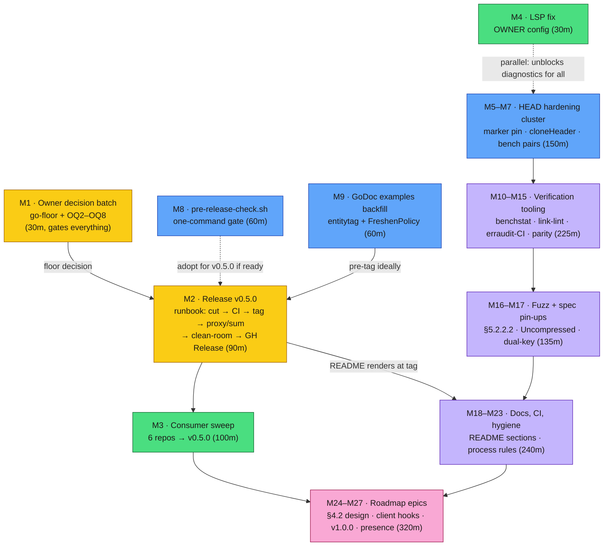

# Pareto Plan — v0.5 Cycle & Full Backlog (go-etag)

_Created: 2026-09-23 01:40 CEST · Mode: pareto-planning (skill) · Format: Markdown + mermaid per explicit user instruction (overrides the skill's HTML default — house precedent)_

**Input backlog:** `TODO_LIST.md` #1–#7 (the living core, rebuilt at the 2026-09-23 docs-health audit), `ROADMAP.md` Open Questions 2–8 + parked items, and the bounded leftovers enumerated in `docs/status/2026-09-23_01-38_docs-health-full-audit-post-v040-metrics.md` §f (50 items). This plan includes ALL of them. Nothing was dropped; items not yet in `TODO_LIST.md` are intentional report-residents (routing decision documented in the audit's §d.3) and are absorbed here.

**Ground rules (verschlimmbessern guard):** no speculative rewrites; owner-gated items are marked OWNER and never executed on assumption; every task ends with the verification gate from AGENTS.md (fmt → lint → vet → race); benchmark-relevant changes capture `-benchmem -count=6` baselines; commits land immediately after each green gate so the daemon cannot race them.

---

## 1. Pareto Breakdown

### The 1% that delivers 51%

**The owner-decision batch + the v0.5.0 release train.**

The `metrics/` package is finished, gated green, and sitting unreleased on master —
consumers can only reach it via a master pseudo-version. Six in-house consumers ride
aging pins. Seven roadmap questions block seven lanes of future work. One structured
decision prompt (go-directive floor + OQ2–OQ8) plus one disciplined release run
(CHANGELOG cut → CI green on exact commit → tag → proxy/sum → clean-room `go get` →
GitHub Release Latest) converts all of it into shipped, consumable value.

### The 4% that delivers 64%

**+ the consumer propagation sweep + the LSP fix.**

A tagged release nobody consumes is half a release: the sweep moves all six in-house
repos onto v0.4.0/v0.5.0 (version surfaces first — flake inputs, vendorHash, CI pins,
DiscordSync's drift-guard; both GOWORK modes; `nix build` when go.sum moved). The LSP
fix (`GOTOOLCHAIN=auto` in the Crush launcher) is one config line that ends the
dead-diagnostics tax every session has paid since the 1.27 bump — compounding value
across every future session in this repo.

### The 20% that delivers 80%

**+ the HEAD-freshening hardening cluster + `scripts/pre-release-check.sh` + the GoDoc examples backfill.**

The hardening cluster closes the repo's entire known test-debt class: the
FromCacheHeader marker spec pin, `cloneHeader` prove-or-delete, coverage check on the
freshening paths, the HEAD-path benchmark, and the stored-validator before-state pair.
The pre-release script turns the release gate into one command (this release shipped
with skipped steps — `go mod verify`, `nolint-audit` — exactly the class the script
prevents). The examples backfill (entitytag round-trip, weak-vs-strong;
`FreshenPerRFC`/`FreshenNone`) fills the only gaps on pkg.go.dev, the library's
primary sales surface.

### The remaining 20% → 100%

Everything else, in rough value order: verification tooling (benchstat, link-lints,
erraudit-in-CI, coverage floor), cross-repo hygiene (httputil template parity, AGENTS
cross-links), fuzz + spec pin-ups (§5.2.2.2 `no-cache`, HEAD × `Uncompressed`,
dual-key edge, mergeHeader), README sections (chaining, troubleshooting, CDN note),
CI polish (`workflow_dispatch`, LICENSE-drift check, dprint decision), process
detectors (archive-gate grep, annotate-script trial, before→after scoring), repo
hygiene (stray HTML, branch protection, homepage URL), and the ROADMAP-grade epics
(§4.2 freshness serving, client hooks, v1.0.0 criteria, public presence).

---

## 2. Comprehensive Plan (medium granularity, 30–100 min, ≤27 tasks)

Sorted by importance / impact / effort / customer value. OWNER = needs an explicit
owner decision or permission before execution.

| #   | Task                                                                                                                                                                                                                                                                                                                                                                       | Importance                                                                                                                                                             | Impact | Effort | Est  | Tier    |
| --- | -------------------------------------------------------------------------------------------------------------------------------------------------------------------------------------------------------------------------------------------------------------------------------------------------------------------------------------------------------------------------- | ---------------------------------------------------------------------------------------------------------------------------------------------------------------------- | ------ | ------ | ---- | ------- |
| M1  | **Owner decision batch** (one structured prompt): go-directive floor for v0.5.0 (restore `1.27.1` vs accept `1.27`), OQ2 Alex fixtures/email, OQ3 release workflow, OQ4 FNV affirm, OQ5 open-low items, OQ6 shim scope, OQ7 constructor trim, OQ8 art-dupl enforcement                                                                                                     | Critical                                                                                                                                                               | High   | S      | 30m  | 1%      |
| M2  | **Release v0.5.0** per the go-release runbook: apply M1's floor decision, CHANGELOG cut (`chore(release): cut CHANGELOG v0.5.0`), commit immediately (daemon race), CI green on exact commit, annotated tag, proxy `.info`-hash + sum.golang.org, clean-room `go get …/metrics@v0.5.0` + build + run, GitHub Release Latest non-prerelease, post-release pkg.go.dev verify | Critical                                                                                                                                                               | High   | M      | 90m  | 1%      |
| M3  | **Consumer propagation sweep** (go-ecosystem-upgrade): all six in-house consumers → v0.5.0; version surfaces first (flake.nix inputs, vendorHash, CI pins, DiscordSync drift-guard); commit after each gate; `nix build` where go.sum changed; both GOWORK modes on workspace repos                                                                                        | Critical                                                                                                                                                               | High   | M      | 100m | 4%      |
| M4  | **LSP fix (OWNER):** set `GOTOOLCHAIN=auto` in the Crush launcher for gopls + golangci-lint-ls; verify diagnostics load; do NOT touch the persisted global go env                                                                                                                                                                                                          | High                                                                                                                                                                   | High   | S      | 30m  | 4%      |
| M5  | **HEAD marker spec pin:** spec test that HEAD-freshened entries never persist the `FromCacheHeader` marker (the 06-18 dedup's incidental invariant); grep `spec_test.go` for existing coverage first; add the negative subtest                                                                                                                                             | High                                                                                                                                                                   | Med    | S      | 45m  | 20%     |
| M6  | **`cloneHeader` prove-or-delete:** prove `entry.header` can(n't) be nil → unit test the branch or delete the guard; coverage check on `persistFreshened`/`cloneHeader` (`go test -coverprofile`)                                                                                                                                                                           | High                                                                                                                                                                   | Med    | S      | 45m  | 20%     |
| M7  | **Benchmark pairs:** HEAD-path `header.Clone()` vs the git-reachable pre-dedup baseline; stored-validator before-state from a `07fe65c^` worktree; file both pairs under `reports/bench/` (`-benchmem -count=6`, interleaved arms)                                                                                                                                         | Medium                                                                                                                                                                 | Med    | M      | 60m  | 20%     |
| M8  | **`scripts/pre-release-check.sh`:** encode the full gate (build, vet, `-race`, lint, erraudit, `nolint-audit .`, `go mod verify`, replace/pseudo check, GOTOOLCHAIN pin); wire into AGENTS.md release conventions; dry-run on master                                                                                                                                       | High                                                                                                                                                                   | High   | M      | 60m  | 20%     |
| M9  | **GoDoc examples backfill:** entitytag (`ExampleParseETag` round-trip, weak-vs-strong comparison, `ParseETagList`), `FreshenPerRFC`, `FreshenNone`; all with `// Output:` (testableexamples)                                                                                                                                                                               | Medium                                                                                                                                                                 | Med    | M      | 60m  | 20%     |
| M10 | **CHANGELOG hygiene:** compare-link casing audit (`Larsartmann` vs `larsartmann`), a link-lint asserting every link resolves; fix findings                                                                                                                                                                                                                                 | Low                                                                                                                                                                    | Low    | S      | 30m  | rest    |
| M11 | **benchstat:** install via sanctioned path; regenerate the four `reports/bench` baselines as comparison tables                                                                                                                                                                                                                                                             | Low                                                                                                                                                                    | Med    | S      | 45m  | rest    |
| M12 | **erraudit-in-CI (OWNER decision + wiring):** blocking default-mode job (0 violations invariant) + informational `nolint-audit`; `[feature:logger]` filter documented in the workflow                                                                                                                                                                                      | Medium                                                                                                                                                                 | Med    | S      | 45m  | rest    |
| M13 | **Coverage floor (OWNER decision):** accept a floor (today: root 100 / server 98.6 / client 99.1 / entitytag 98.9 / metrics 96.8) and gate it in CI, or drop the idea explicitly                                                                                                                                                                                           | Low                                                                                                                                                                    | Low    | S      | 30m  | rest    |
| M14 | **Dependency sanity:** gosec note on `Code`/`Domain` template-injection surface; read the go-error-family v0.10.0→v0.10.1 diff (bumped blind at `7ae7501`)                                                                                                                                                                                                                 | Low                                                                                                                                                                    | Low    | S      | 30m  | rest    |
| M15 | **httputil template parity:** verify httputil's suite pins go-etag's `errorTemplates` values verbatim (verify-before-filing); upstream a mirror test if absent; cross-link AGENTS error sections both repos                                                                                                                                                                | Medium                                                                                                                                                                 | Med    | S      | 45m  | rest    |
| M16 | **Fuzz expansion:** stored-validator property (symmetric `weaklyMatches`; unparseable stored ⇒ false), `mergeHeader`, Cache-Control directive variants — mirror `FuzzHasNoStoreDirective`'s seed+soundness pattern; wire seeds into the CI fuzz job                                                                                                                        | Medium                                                                                                                                                                 | Med    | M      | 75m  | rest    |
| M17 | **Spec pin-ups:** request-side `no-cache` (§5.2.2.2), HEAD-freshening × `resp.Uncompressed` interplay, `restoreMismatchedValidator` restricted-mode+dual-key edge — each citing its RFC section                                                                                                                                                                            | Medium                                                                                                                                                                 | Med    | M      | 60m  | rest    |
| M18 | **Post-release verification:** link-check `docs/rfc9111-conformance.md` Interpretation section; pkg.go.dev renders `metrics` + the four package READMEs at v0.5.0                                                                                                                                                                                                          | Low                                                                                                                                                                    | Low    | S      | 30m  | rest    |
| M19 | **Process hardening:** numbered-item detector before archive moves (`grep -n '^\s*\d\+\.\s\*\*' <f>                                                                                                                                                                                                                                                                        | grep -v '~~'`);`annotate-rows.py --dry-run` trial on one annotated file; before→after scoring rule for audit sessions — recorded in AGENTS.md where sessions read them | Medium | Med    | S    | 45m     |
| M20 | **Micro-policies in AGENTS.md:** docs-only sessions ⇒ no CHANGELOG entry; check-rows PARTIAL = house style for task tables; status-archive convention (once M1 answers g.3)                                                                                                                                                                                                | Low                                                                                                                                                                    | Med    | S      | 30m  | rest    |
| M21 | **README sections:** "Middleware Chaining" (compose with logging/CORS/recovery), "Troubleshooting" (no ETag on POST, 304 not returned, buffer overflow), CDN/proxy ETag-stripping note                                                                                                                                                                                     | Low                                                                                                                                                                    | Med    | M      | 60m  | rest    |
| M22 | **CI polish:** `workflow_dispatch` trigger for probes; LICENSE/README drift check; decide dprint-in-CI vs "daemon is the formatter of record"                                                                                                                                                                                                                              | Low                                                                                                                                                                    | Low    | S      | 45m  | rest    |
| M23 | **Repo hygiene:** archive/trash the stray `workflow-audit-log-20260911-*.html` at root; branch protection on master (OWNER); homepage URL → pkg.go.dev (OWNER)                                                                                                                                                                                                             | Low                                                                                                                                                                    | Low    | S      | 30m  | rest    |
| M24 | **ROADMAP Theme 1 design doc:** opt-in §4.2 freshness serving (`max-age`/`Expires` parsing, serve-within-freshness, default stays accelerator), incl. spec-test plan and conformance-table impact                                                                                                                                                                          | High                                                                                                                                                                   | High   | L      | 100m | roadmap |
| M25 | **ROADMAP Theme 3 spike:** client hooks `OnHit`/`OnStore`/`OnFreshen`/`OnInvalidate` (mirror server hooks; complements `metrics/`) — design + demand note                                                                                                                                                                                                                  | Medium                                                                                                                                                                 | Med    | L      | 100m | roadmap |
| M26 | **v1.0.0 criteria + shim-removal checklist:** what gates the major besides shim deletion; the deletion checklist (`deprecated.go`, root `doc.go`, `deprecated_test.go`, docs sweep, consumer audit)                                                                                                                                                                        | Medium                                                                                                                                                                 | Med    | M      | 60m  | roadmap |
| M27 | **Public presence spike:** comparison table vs other Go ETag/caching libraries, awesome-go submission draft, website-launch evaluation (Theme 4)                                                                                                                                                                                                                           | Low                                                                                                                                                                    | Med    | M      | 60m  | roadmap |

---

## 3. Fine-Grained Breakdown (≤12 min per task)

Sorted within each parent by execution order; every task ends with a verification
step where applicable (V = run the AGENTS.md gate subset relevant to the change).

| #   | Task                                                                                                                               | Parent | Est |
| --- | ---------------------------------------------------------------------------------------------------------------------------------- | ------ | --- |
| F1  | Draft the 8-question structured decision prompt (go floor, OQ2–OQ8) with one-line evidence each                                    | M1     | 10m |
| F2  | Deliver prompt to owner; record answers verbatim in ROADMAP (annotate open questions) + TODO_LIST                                  | M1     | 5m  |
| F3  | Apply the go-floor decision: restore `go 1.27.1` in go.mod OR update README badge + AGENTS + CI-pin story for `1.27`               | M1/M2  | 6m  |
| F4  | Re-read CHANGELOG `[Unreleased]`; verify it covers the intended v0.5.0 scope (metrics + examples + stored-validator note)          | M2     | 8m  |
| F5  | Cut CHANGELOG: `[Unreleased]` → `[0.5.0] - <date>`, restore empty placeholders, shift compare links                                | M2     | 8m  |
| F6  | Commit the cut immediately (`chore(release): cut CHANGELOG v0.5.0`) — beat the daemon                                              | M2     | 2m  |
| F7  | Full local gate: fmt → lint → vet → `go test -race -count=1 ./...` (GOTOOLCHAIN=auto)                                              | M2     | 10m |
| F8  | Verify CI green on the exact release commit (`gh run list --commit`)                                                               | M2     | 5m  |
| F9  | Create + push annotated tag `v0.5.0`; watch the frozen tag run                                                                     | M2     | 6m  |
| F10 | Verify proxy `.info` hash == release commit; sum.golang.org lookup recorded                                                        | M2     | 8m  |
| F11 | Clean-room consumer: `/tmp` module, `go get …/metrics@v0.5.0`, build + run an Attach/HitRatio smoke                                | M2     | 10m |
| F12 | GitHub Release v0.5.0: curated notes (house voice, breaking-first if any), Latest, non-prerelease                                  | M2     | 10m |
| F13 | Post-release: pkg.go.dev `/fetch` + verify `metrics` directory + package READMEs render                                            | M2     | 8m  |
| F14 | Trash temp artifacts; verify tree clean                                                                                            | M2     | 2m  |
| F15 | Enumerate consumers + version surfaces (`rg` across `~/projects`; flake inputs, vendorHash, CI pins per repo)                      | M3     | 10m |
| F16 | Sweep httputil → v0.5.0 (go.work rename-dance F2; build+race; commit after gate)                                                   | M3     | 12m |
| F17 | Sweep go-github-kit → v0.5.0 (vendor refresh; lint — the one real-code consumer)                                                   | M3     | 12m |
| F18 | Sweep DiscordSync → v0.5.0 (flake input repin + `nix flake lock --update-input`; drift-guard green; `nix build`)                   | M3     | 12m |
| F19 | Sweep library-policy + nsfw-classifier → v0.5.0 (vendorHash rotation in nsfw; `nix build` both)                                    | M3     | 12m |
| F20 | Sweep cqrs-htmx middleware-showcase (GOWORK=off); workspace-mode build + train checker                                             | M3     | 12m |
| F21 | Global residual grep: no pre-0.4 direct requires, no stale pins in CI/Dockerfiles                                                  | M3     | 6m  |
| F22 | Set `GOTOOLCHAIN=auto` in the Crush LSP launcher config (OWNER GO first)                                                           | M4     | 4m  |
| F23 | `lsp_restart`; confirm gopls + golangci-lint-ls load with zero project errors                                                      | M4     | 6m  |
| F24 | Grep `spec_test.go` for existing HEAD × FromCacheHeader coverage (close the 06-18 b.1 gap)                                         | M5     | 6m  |
| F25 | Write `TestSpecHeadFresheningDoesNotPersistFromCacheMarker` (primed entry with marker; confirming HEAD; assert stored entry clean) | M5     | 10m |
| F26 | Run race gate on `./client`; annotate the 06-18 b.1/c.1 items resolved                                                             | M5     | 6m  |
| F27 | Prove `entry.header` nil-ability: trace every `store`/`freshen` path; write the proof as a doc comment                             | M6     | 10m |
| F28 | Unit-test `cloneHeader` nil branch OR delete the guard (per F27 proof); keep the doc comment honest                                | M6     | 10m |
| F29 | `go test -coverprofile` on client; confirm `persistFreshened`/`cloneHeader` lines covered; document intentional gaps               | M6     | 8m  |
| F30 | Worktree at pre-dedup commit; capture HEAD-path bench baseline (`-benchmem -count=6`)                                              | M7     | 10m |
| F31 | Capture post-change HEAD-path arm interleaved; file the pair under `reports/bench/`                                                | M7     | 10m |
| F32 | Worktree at `07fe65c^`; capture stored-validator before-state; pair with the existing after baseline                               | M7     | 10m |
| F33 | Write `scripts/pre-release-check.sh` (build/vet/race/lint/erraudit/nolint-audit/`go mod verify`/replace check/GOTOOLCHAIN)         | M8     | 12m |
| F34 | `chmod +x`; dry-run on master; fix failures until exit 0                                                                           | M8     | 10m |
| F35 | Reference the script in AGENTS.md Release Conventions + CONTRIBUTING                                                               | M8     | 6m  |
| F36 | `ExampleParseETag` (round-trip incl. weak form) with `// Output:`                                                                  | M9     | 10m |
| F37 | `ExampleETag_weakVsStrong` (StrongEqual vs WeakEqual contrast)                                                                     | M9     | 10m |
| F38 | `ExampleParseETagList` (multi-tag list with wildcard-free cases)                                                                   | M9     | 8m  |
| F39 | `ExampleFreshenPerRFC` + `ExampleFreshenNone` (mirror `ExampleFreshenPolicy` structure)                                            | M9     | 10m |
| F40 | testableexamples check + full gate; commit examples wave                                                                           | M9     | 6m  |
| F41 | CHANGELOG casing audit: list all link refs; normalize `Larsartmann` vs `larsartmann` per reality                                   | M10    | 8m  |
| F42 | Link-lint: one-liner script or manual sweep asserting every compare/release link resolves                                          | M10    | 10m |
| F43 | Install benchstat (nix profile or devshell); smoke-run on an existing baseline pair                                                | M11    | 10m |
| F44 | Regenerate the four baseline comparisons as benchstat tables under `reports/bench/`                                                | M11    | 12m |
| F45 | OWNER: decide erraudit-CI posture (blocking default-mode job? informational nolint-audit?)                                         | M12    | 5m  |
| F46 | Wire the job(s) into `ci.yml`; document the `[feature:logger]` filter; verify a green run                                          | M12    | 12m |
| F47 | OWNER: coverage floor number or explicit drop; record in AGENTS                                                                    | M13    | 5m  |
| F48 | If adopted: coverage threshold step in the CI test job; red-green test                                                             | M13    | 10m |
| F49 | gosec sanity: confirm no template-injection surface in errorfamily rendering; write the note in AGENTS error section               | M14    | 10m |
| F50 | Read go-error-family v0.10.0→v0.10.1 diff; record anything consumer-relevant                                                       | M14    | 10m |
| F51 | Verify httputil's test suite pins go-etag template values (open its repo; grep `http.etag_`)                                       | M15    | 10m |
| F52 | If unpinned: upstream a mirror test (verify-before-filing); else record verified                                                   | M15    | 12m |
| F53 | Cross-link AGENTS.md error sections go-etag ↔ httputil (one line each)                                                             | M15    | 6m  |
| F54 | `FuzzStoredValidatorWeaklyMatches` (symmetry + unparseable⇒false properties, seeds from the 10-case table)                         | M16    | 12m |
| F55 | `FuzzMergeHeader` (exact-then-canonical duality; no-panic + key-visibility property)                                               | M16    | 12m |
| F56 | Extend Cache-Control fuzzing to directive-variant corpus (`no-cache="ext"`, casing, quoted args)                                   | M16    | 12m |
| F57 | Wire new seeds into the CI fuzz job; local 20s smokes                                                                              | M16    | 8m  |
| F58 | Spec pin: request `no-cache` (§5.2.2.2) forces revalidation semantics                                                              | M17    | 10m |
| F59 | Spec pin: HEAD-freshening × `resp.Uncompressed` stored entry                                                                       | M17    | 10m |
| F60 | Spec pin: `restoreMismatchedValidator` restricted-mode + dual-key edge                                                             | M17    | 10m |
| F61 | Link-check `docs/rfc9111-conformance.md` Interpretation section (every RFC anchor resolves)                                        | M18    | 6m  |
| F62 | pkg.go.dev re-check (rides F13 if sequenced after release)                                                                         | M18    | 4m  |
| F63 | Add the archive-gate numbered-item detector to the docs-health pass checklist (AGENTS.md Repo Workflow Notes)                      | M19    | 8m  |
| F64 | Trial `annotate-rows.py --dry-run` on one annotated file; record fit/verdict for future passes                                     | M19    | 10m |
| F65 | Record before→after scoring rule for audit sessions (AGENTS.md)                                                                    | M19    | 6m  |
| F66 | AGENTS.md: docs-only ⇒ no CHANGELOG entry; check-rows PARTIAL = house style; status-archive convention (post-M1)                   | M20    | 10m |
| F67 | README: write "Middleware Chaining" section (3 compose examples)                                                                   | M21    | 12m |
| F68 | README: write "Troubleshooting" section (4 Q/A entries)                                                                            | M21    | 12m |
| F69 | README: CDN/proxy ETag-stripping note (one paragraph)                                                                              | M21    | 6m  |
| F70 | ci.yml: add `workflow_dispatch` trigger; YAML validate                                                                             | M22    | 6m  |
| F71 | LICENSE/README drift check (badge vs LICENSE vs repo metadata) — script or CI step                                                 | M22    | 10m |
| F72 | Decide dprint-in-CI vs daemon-as-formatter-of-record; write the decision down                                                      | M22    | 6m  |
| F73 | Archive/trash `workflow-audit-log-20260911-*.html` at repo root                                                                    | M23    | 4m  |
| F74 | OWNER: branch protection on master (required checks) + homepage URL                                                                | M23    | 6m  |
| F75 | Theme 1 doc §1: problem statement + accelerator-vs-cache framing                                                                   | M24    | 12m |
| F76 | Theme 1 doc §2: opt-in API sketch (`Options.Freshness` / policy type)                                                              | M24    | 12m |
| F77 | Theme 1 doc §3: §4.2/§5.2 parsing scope + conformance-table impact                                                                 | M24    | 12m |
| F78 | Theme 1 doc §4: spec-test plan + risks (Vary interplay, no-store precedence)                                                       | M24    | 12m |
| F79 | Theme 1 doc §5: Pareto execution tiers + open questions for the owner                                                              | M24    | 10m |
| F80 | Theme 3 spike: hook signatures + impossibility analysis (mirror server's single-datum rule)                                        | M25    | 12m |
| F81 | Theme 3 spike: `metrics/` extension sketch (`ClientCounters.Attach`?) + demand note                                                | M25    | 12m |
| F82 | v1.0.0 doc: criteria list (shim deletion + what else gates the major)                                                              | M26    | 10m |
| F83 | v1.0.0 doc: shim-removal checklist (files, docs sweep, consumer audit, release notes)                                              | M26    | 10m |
| F84 | Public presence: comparison table research + draft (vs humidor/other Go ETag libs)                                                 | M27    | 12m |
| F85 | awesome-go submission draft; website-launch go/no-go note (Theme 4)                                                                | M27    | 12m |

---

## 4. Execution Graph

**Sequencing notes:** M1 → M2 is the spine; M8 and M9 land ideally _before_ M2 (the
script guards the release; the examples render on pkg.go.dev at the tag) but do not
block it. M4 is parallelizable any time the OWNER grants it. Everything in the rest
tier is order-independent; roadmap epics are demand-gated by definition.

---

## 5. What is deliberately NOT in this plan

- **Executing the owner decisions** — M1 records them; it does not make them.
- **ROADMAP non-goals** (server-side If-Match interception, full §6 precedence, If-Range, telemetry dep in core, `reports/` second location) — settled scope boundaries, not tasks.
- **The ~25 open-low August items** — pending OQ5 (promote-or-die); if promoted, they enter a follow-up plan via docs-health HARVEST.

_Plan is a point-in-time snapshot (goes stale). The living backlog is `TODO_LIST.md`; owner decisions live in `ROADMAP.md` Open Questions. Created per the pareto-planning skill; `.md` format honors the explicit user instruction over the skill's HTML default._
