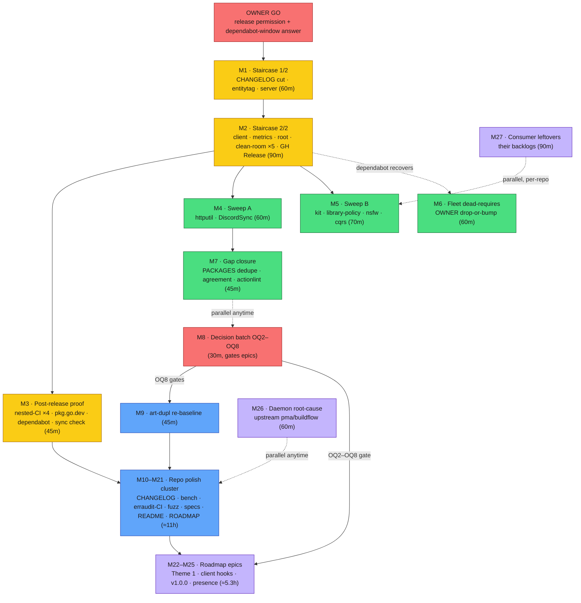

# Pareto Plan — v0.6.0 Module-Split Release & Full Backlog (go-etag)

_Created: 2026-09-23 14:07 CEST · Mode: pareto-planning (skill) · Format: Markdown + mermaid per explicit user instruction (overrides the skill's HTML default — house precedent, same as the 01:40 plan)_

**Input backlog:** `TODO_LIST.md` #1–#4 (living core), the unexecuted remainder of `docs/planning/2026-09-23_01-40_pareto-v05-cycle-full-backlog.md` (M1 owner batch + M10–M27; M2–M9 shipped with v0.5.0), and §f of `docs/status/2026-09-23_05-56_module-split-five-modules-execution.md` (40 module-split follow-ups). Deduplicated; nothing dropped. This plan includes ALL open TODOs.

**State at plan time (context you need):** the 2026-09-23 module split is **landed on master but unreleased** — five modules on a shared v0.6.0 train, every local gate green (`scripts/pre-release-check.sh` exit 0), but the nested tags do not exist yet, so (a) `go get …@master` cannot resolve the v0.6.0 internal requires, (b) dependabot cannot resolve the four nested manifests, and (c) consumers cannot benefit from the split. The staircase is the spine of this plan. Pushing master (any push, including this plan) also pushes the split — first real CI run of the multi-module workflow; v0.6.0 should tag soon after.

**Ground rules (verschlimmbessern guard):** no speculative rewrites; OWNER items are never executed on assumption; every code task ends with the AGENTS.md gate (fmt → lint ×5 modules → vet → race, `GOTOOLCHAIN=auto` prefixed); benchmark-relevant changes capture `-benchmem -count=6` pairs under `reports/bench/`; commits land immediately after each green gate (daemon race); tags are immutable — each staircase step verifies CI green BEFORE its tag.

---

## 1. Pareto Breakdown

### The 1% that delivers 51%

**The v0.6.0 staircase (M1–M3) + the owner GO that unlocks it.**

Everything is built, gated, and idle. One disciplined release train — CHANGELOG cut → entitytag/server/client/metrics/root stair (tidy + verify + GOWORK=off + CI green + annotated tag each, bottom-up) → proxy/sum ×5 → clean-room `go get` ×5 → GitHub Release — converts the whole split into shipped value: consumers get module-scoped dependencies, dependabot's nested manifests start resolving, pkg.go.dev grows four module pages, and the first nested-tag CI runs prove the trigger fix. Without it, the repo sits in the awkward half-state where `@master` doesn't resolve.

### The 4% that delivers 64%

**+ the consumer propagation sweep (M4–M6) + verification-gap closure (M7).**

A split nobody consumes is half a split: six in-house repos bump to v0.6.0 (`go mod tidy` gains nested requires; version surfaces first — flake inputs, vendorHash, drift-guards, both GOWORK modes), and the ~35-repo dead-requires fleet gets its drop-or-bump decision executed. Gap closure (CI pattern dedupe, workflow↔script agreement check, actionlint habit, post-tag `go work sync` idempotency) hardens the exact tooling class this split touched — the class that produced the tag-trigger miss.

### The 20% that delivers 80%

**+ the owner decision batch (M8) + the repo-polish cluster (M9–M21).**

OQ2–OQ8 answers unblock the entire roadmap epic tier (M22–M25) and settle standing policy (art-dupl enforcement, shim scope, constructor trim, open-low promote-or-die). The polish cluster is the carried 01:40 "rest" tier plus split-specific debt: art-dupl re-baseline (AGENTS claims 1 accepted group; tool shows 4 — the doc lies until fixed), CHANGELOG link-lint, benchstat tables + the five-module no-drift proof, erraudit-in-CI, coverage floor, httputil template parity, fuzz expansion, spec pin-ups, README sections, process rules, ROADMAP annotations seeding the v1.0.0 root-deletion runbook.

### The remaining 20% → 100%

Roadmap epics (Theme 1 §4.2 freshness design doc, Theme 3 client hooks spike, v1.0.0 criteria, public presence), the consumer-repo leftovers that live in their own backlogs (TODO_LIST #3), and the upstream daemon go-directive root-cause — the only known recurring external attacker on this repo's go.mod files.

---

## 2. Comprehensive Plan (medium granularity, 30–100 min, 27 tasks)

Sorted by importance / impact / effort / customer value. OWNER = explicit owner decision or permission first. Est = focused estimate.

| #   | Task                                                                                                                                                                                      | Importance | Impact | Effort | Est  | Tier    |
|---|---|---|---|---|---|---|
|~~M1~~ done — `80bc256` cut; `entitytag/v0.6.0`→`80bc256`, `server/v0.6.0`→`609bf83` (report 16:40 a1)|~~**Staircase part 1 (OWNER GO):** final gate run, CHANGELOG cut (`chore(release): cut CHANGELOG v0.6.0`), entitytag stair (tidy/verify/GOWORK=off build+race/CI green/annotated `entitytag/v0.6.0`/proxy+sum), server stair (same → `server/v0.6.0`)~~|~~Critical~~|~~High~~|~~S/M~~|~~60m~~|~~1%~~|
|~~M2~~ done — client/metrics/root stairs, clean-room ×5, GitHub Release (report 16:40 a1–a2)|~~**Staircase part 2:** client stair, metrics stair, root stair (final tidy, root tag `v0.6.0`, frozen CI run), clean-room `go get` ×5 + smokes (Attach/HitRatio, NewTransport, New, ParseETag), GitHub Release Latest non-prerelease, train bumped for next cycle~~|~~Critical~~|~~High~~|~~M~~|~~90m~~|~~1%~~|
|~~M3~~ done — report 16:40 a3|~~**Post-release proof:** nested-tag CI runs ×4 green (trigger-fix proof), pkg.go.dev ×5 renders, dependabot nested manifests recover, post-tag `go work sync` idempotency added to the gate, root go.sum pruned~~|~~High~~|~~High~~|~~S~~|~~45m~~|~~1%~~|
|~~M4~~ done — report 16:40 a4|~~**Consumer sweep A:** httputil + DiscordSync → v0.6.0 (nested requires via tidy; version surfaces first; drift-guard; both GOWORK modes; `nix build` where go.sum moved)~~|~~Critical~~|~~High~~|~~M~~|~~60m~~|~~4%~~|
|~~M5~~ done — report 16:40 a4–a5|~~**Consumer sweep B:** go-github-kit (vendor refresh + lint), library-policy, nsfw-classifier (vendorHash rotation), cqrs-htmx (GOWORK=off + train checker) → v0.6.0; global residual grep (no pre-v0.6.0 pins)~~|~~Critical~~|~~High~~|~~M~~|~~70m~~|~~4%~~|
|~~M6~~ done — batch-bumped per owner decision, `ab1bcec`|~~**Fleet dead-requires (OWNER decision then batch):** ~35 repos carrying unimported go-etag v0.3.1 requires — drop or bump, execute, grep-verify zero residuals~~|~~Medium~~|~~Med~~|~~M~~|~~60m~~|~~4%~~|
|~~M7~~ done — `1bf30c9` (report 16:40 a6)|~~**Verification-gap closure:** ci.yml PACKAGES env dedupe (5 duplicated pattern sets), workflow↔pre-release-check.sh pattern-agreement check, actionlint habit for workflow edits, post-tag sync check (rides M3)~~|~~High~~|~~Med~~|~~S~~|~~45m~~|~~4%~~|
|~~M8~~ done — `ab1bcec`; resolutions in `ROADMAP.md`|~~**Owner decision batch OQ2–OQ8:** Alex fixtures/email, release workflow, FNV affirm, open-low promote-or-die, shim scope, constructor trim, art-dupl enforcement — one structured prompt, answers recorded in ROADMAP~~|~~High~~|~~High~~|~~S~~|~~30m~~|~~20%~~|
|~~M9~~ done — report 16:40 a7|~~**art-dupl re-baseline:** fresh run vs AGENTS "exactly 1 accepted group" claim; classify the 4 shown groups (accept-document or extract); AGENTS clone-group entry updated to current truth~~|~~High~~|~~Med~~|~~S~~|~~45m~~|~~20%~~|
|~~M10~~ done — report 16:40 a9|~~**CHANGELOG hygiene:** compare-link casing audit (`Larsartmann` vs `larsartmann`), link-lint asserting every compare/release link resolves; fix findings~~|~~Low~~|~~Low~~|~~S~~|~~30m~~|~~20%~~|
| M11 | **benchstat + module baseline:** install, regenerate the four `reports/bench` comparisons as tables, and capture the five-module post-split baseline proving zero perf drift from the split                                                            | Medium     | Med    | S/M    | 45m  | 20%     |
| M12 | **erraudit-in-CI (OWNER posture):** blocking default-mode job (0-violations invariant) + informational per-module nolint-audit; `[feature:logger]` filter documented in the workflow                                                                  | Medium     | Med    | S      | 45m  | 20%     |
| M13 | **Coverage floor (OWNER):** accept per-module floors (now: root 100 / server 98.6 / client 99.1 / entitytag 98.9 / metrics 96.8) + CI gate, or drop the idea explicitly                                                                               | Low        | Low    | S      | 30m  | 20%     |
| M14 | **Dependency sanity:** gosec note on `Code`/`Domain` template surface; read go-error-family v0.10.0→v0.10.1 diff (bumped blind at `7ae7501`)                                                                                                         | Low        | Low    | S      | 30m  | 20%     |
| M15 | **httputil template parity:** verify its suite pins go-etag's `errorTemplates` verbatim; upstream a mirror test if absent; cross-link AGENTS error sections both repos                                                                               | Medium     | Med    | S      | 45m  | 20%     |
| M16 | **Fuzz expansion:** `FuzzStoredValidatorWeaklyMatches` (symmetry, unparseable⇒false), `FuzzMergeHeader`, Cache-Control directive-variant corpus; seeds wired into the CI fuzz job                                                                      | Medium     | Med    | M      | 75m  | 20%     |
| M17 | **Spec pin-ups:** request `no-cache` (§5.2.2.2), HEAD-freshening × `resp.Uncompressed`, `restoreMismatchedValidator` restricted-mode + dual-key edge — each citing its section                                                                          | Medium     | Med    | M      | 60m  | 20%     |
| M18 | **Process hardening + micro-policies:** archive-gate numbered-item detector, `annotate-rows.py --dry-run` trial, before→after scoring rule, docs-only⇒no-CHANGELOG, PARTIAL house style, status-archive convention (post-M8)                          | Medium     | Med    | S      | 60m  | 20%     |
| M19 | **README + docs sections:** Middleware Chaining, Troubleshooting, CDN ETag-stripping note; `docs/rfc9111-conformance.md` module-consumability note; AGENTS erraudit `--explain` restore-or-drop                                                        | Low        | Med    | M      | 60m  | 20%     |
| M20 | **CI polish + repo hygiene:** `workflow_dispatch`, LICENSE/README drift check, dprint-in-CI decision, OWNER branch protection + homepage URL (stray root HTML already trashed at `bca4525`)                                                           | Low        | Low    | S      | 45m  | 20%     |
| M21 | **ROADMAP annotations:** OQ1 resolution history (entitytag → module split), otel sub-module unblocked-by-architecture note, v1.0.0 root-module-deletion runbook seed                                                                                  | Medium     | Med    | S      | 45m  | 20%     |
| M22 | **Theme 1 design doc:** opt-in §4.2 freshness serving (`max-age`/`Expires` parsing, serve-within-freshness, default stays accelerator), spec-test plan, conformance-table impact                                                                       | High       | High   | L      | 100m | rest    |
| M23 | **Theme 3 spike:** client hooks `OnHit`/`OnStore`/`OnFreshen`/`OnInvalidate` (mirror server hooks; complements `metrics/`) — signatures + impossibility analysis + `ClientCounters` sketch                                                              | Medium     | Med    | L      | 100m | rest    |
| M24 | **v1.0.0 criteria + deletion checklist:** what gates the major besides shim deletion; the deletion checklist now also removes the root MODULE (its own mini-staircase)                                                                                | Medium     | Med    | M      | 60m  | rest    |
| M25 | **Public presence spike:** comparison table vs other Go ETag/caching libraries, awesome-go submission draft, website-launch evaluation                                                                                                                 | Low        | Med    | M      | 60m  | rest    |
| M26 | **Daemon go-directive root-cause (upstream):** identify which pma/buildflow operation rewrites `go 1.27.1`→`1.27` (twice now: `969d077`, `6f15f81`); fix or file upstream — the parity check catches it, but the source keeps re-offending                                                                           | Medium     | Med    | M      | 60m  | rest    |
| M27 | **Consumer-repo leftovers (their backlogs, listed for handoff):** library-policy 307-line `structured_formatters.go` quality gate, cqrs-htmx toolchain pin (1.26.7 < floor, checker red), DiscordSync's two pre-existing test failures                                                                               | Low        | Med    | M      | 90m  | rest    |

**Total: ~21.3 h focused.** Spine: M1→M2→M3→M4/M5 (M6 parallel) → M8 gates M22–M25.

---

## 3. Fine-Grained Breakdown (≤12 min per task)

Every task ends with its verification step (V = the AGENTS.md gate subset relevant to the change). Sorted by parent (execution order); parents ordered per §2.

| #     | Task (≤12 min)                                                                                                                                    | Parent | Est |
|---|---|---|---|
| F1    | Final `scripts/pre-release-check.sh` run on the release-prep commit (exit 0 required)                                                             | M1     | 10m |
| F2    | Re-read CHANGELOG `[Unreleased]`; verify it covers split + fuzz-fix + directive-fix                                                                | M1     | 6m  |
| F3    | Cut CHANGELOG: `[Unreleased]` → `[0.6.0] - 2026-09-23`, empty placeholders, compare links                                                          | M1     | 8m  |
| F4    | Commit the cut immediately (`chore(release): cut CHANGELOG v0.6.0`) — beat the daemon                                                             | M1     | 2m  |
| F5    | entitytag stair: `go mod tidy` + `go mod verify` + `GOWORK=off go build/test -race ./...` from `entitytag/`                                        | M1     | 10m |
| F6    | CI green on that commit; annotated tag `entitytag/v0.6.0` + push; watch frozen run                                                                | M1     | 8m  |
| F7    | Verify proxy `.info` hash == tagged commit + sum.golang.org entry for entitytag                                                                   | M1     | 6m  |
| F8    | server stair: tidy (resolves entitytag@v0.6.0; direct fallback if proxy lags) + verify + GOWORK=off build/race from `server/`                      | M1     | 12m |
| F9    | CI green; annotated tag `server/v0.6.0` + push; proxy/sum verified                                                                                | M1     | 10m |
| F10   | client stair: tidy + verify + GOWORK=off; CI green; tag `client/v0.6.0`; proxy/sum                                                                | M2     | 12m |
| F11   | metrics stair: tidy + verify + GOWORK=off; CI green; tag `metrics/v0.6.0`; proxy/sum                                                              | M2     | 12m |
| F12   | root stair: root tidy (prunes stale go-error-family from go.sum), final commit, CI green, annotated tag `v0.6.0`, frozen run                                                        | M2     | 12m |
| F13   | Clean-room ×5: fresh `/tmp` modules, `go get` each module@v0.6.0, smoke (Attach/HitRatio, NewTransport, New, ParseETag)                            | M2     | 12m |
| F14   | GitHub Release v0.6.0: curated notes (migration note: nested `go get` paths), Latest, non-prerelease                                               | M2     | 10m |
| F15   | Post-release train state: go.work replaces + requires consistent at v0.6.0; pre-release-check train-sync section green                             | M2     | 6m  |
| F16   | Observe the four nested-tag CI runs green (trigger-fix proof)                                                                                     | M3     | 6m  |
| F17   | pkg.go.dev `/fetch`; verify all five module pages + package READMEs render                                                                        | M3     | 8m  |
| F18   | Dependabot nested-manifest recovery check (run logs clean, no resolution errors)                                                                  | M3     | 6m  |
| F19   | Add post-tag `go work sync && git diff --exit-code` idempotency step to the gate/script flag                                                       | M3     | 8m  |
| F20   | Root go.sum pruned (verify via F12; assert no stale error-family lines)                                                                           | M3     | 4m  |
| F21   | httputil: bump go-etag → v0.6.0; `go mod tidy` gains nested requires; build + race green                                                           | M4     | 12m |
| F22   | httputil: both GOWORK modes + `nix build` (go.sum moved); commit after gate                                                                       | M4     | 10m |
| F23   | DiscordSync: bump + flake input repin + drift-guard green + `nix build`                                                                           | M4     | 12m |
| F24   | go-github-kit: bump + vendor refresh + lint (the one real-code consumer)                                                                          | M5     | 12m |
| F25   | library-policy: bump + gates green + commit                                                                                                       | M5     | 10m |
| F26   | nsfw-classifier: bump + vendorHash rotation + `nix build`                                                                                         | M5     | 12m |
| F27   | cqrs-htmx: bump + `GOWORK=off` build + workspace train checker                                                                                    | M5     | 12m |
| F28   | Global residual grep: zero pre-v0.6.0 direct requires, zero stale CI/Dockerfile pins across `~/projects`                                          | M5     | 6m  |
| F29   | OWNER decision: drop vs bump the ~35 dead-requires repos (one structured prompt)                                                                  | M6     | 5m  |
| F30   | Batch-execute per F29 decision (repeating ~10m chunks); grep-verify zero residuals                                                                | M6     | 12m* |
| F31   | ci.yml: hoist PACKAGES to workflow env; reference from build/vet/test/coverage steps                                                              | M7     | 10m |
| F32   | Agreement check: ci.yml pattern set ≡ pre-release-check.sh PACKAGES (tiny grep test, wired into the script)                                        | M7     | 10m |
| F33   | actionlint: install (devshell or habit); run on both workflow files; fix findings                                                                 | M7     | 8m  |
| F34   | Draft the 7-question OQ2–OQ8 structured decision prompt (one-line evidence each)                                                                  | M8     | 10m |
| F35   | Deliver prompt to owner; record answers verbatim in ROADMAP (annotate open questions)                                                             | M8     | 5m  |
| F36   | Apply OQ8: art-dupl enforcement policy (blocks M9 follow-through)                                                                                  | M8     | 6m  |
| F37   | Apply OQ6/OQ7: shim scope + constructor trim decisions into TODO_LIST or close                                                                    | M8     | 8m  |
| F38   | Apply OQ2: Alex fixtures/email decision; draft reply if accepted                                                                                  | M8     | 12m |
| F39   | Apply OQ5: open-low promote-or-die triage (~25 annotated items → TODO_LIST or graveyard)                                                          | M8     | 12m |
| F40   | Fresh `art-dupl -t 1 --type-aware` run; capture output; diff vs AGENTS claim                                                                      | M9     | 6m  |
| F41   | Classify each shown group (etag.go pair, transport.go ×3): accept-with-rationale or extract                                                                                         | M9     | 12m |
| F42   | Rewrite the AGENTS clone-group entry to match verified reality; nolint/docs as needed                                                             | M9     | 8m  |
| F43   | CHANGELOG casing audit: list link refs; normalize per reality                                                                                     | M10    | 8m  |
| F44   | Link-lint: assert every compare/release link resolves (one-liner script or manual sweep)                                                          | M10    | 10m |
| F45   | Install benchstat (sanctioned path); smoke-run on an existing baseline pair                                                                       | M11    | 8m  |
| F46   | Regenerate the four `reports/bench` comparisons as benchstat tables                                                                               | M11    | 12m |
| F47   | Five-module post-split bench baseline vs pre-split commit (worktree); prove zero drift; file the pair                                             | M11    | 12m |
| F48   | OWNER: erraudit-CI posture (blocking default-mode? informational nolint-audit?)                                                                   | M12    | 5m  |
| F49   | Wire per-module erraudit job(s) into ci.yml; document `[feature:logger]` filter                                                                   | M12    | 12m |
| F50   | Verify a green CI run with the job active; red-green test with a planted violation (revert immediately)                                           | M12    | 8m  |
| F51   | OWNER: coverage floor numbers per module or explicit drop; record in AGENTS                                                                       | M13    | 5m  |
| F52   | If adopted: coverage threshold step in CI test job; red-green test                                                                                | M13    | 10m |
| F53   | gosec sanity note on errorfamily template rendering surface (AGENTS error section)                                                               | M14    | 10m |
| F54   | Read go-error-family v0.10.0→v0.10.1 diff; record consumer-relevant changes                                                                       | M14    | 10m |
| F55   | Verify httputil's suite pins go-etag `errorTemplates` values (grep `http.etag_`)                                                                  | M15    | 10m |
| F56   | If unpinned: upstream mirror test (verify-before-filing); else record verified                                                                    | M15    | 12m |
| F57   | Cross-link AGENTS error sections go-etag ↔ httputil (one line each)                                                                              | M15    | 6m  |
| F58   | `FuzzStoredValidatorWeaklyMatches`: symmetry + unparseable⇒false properties, 10-case seeds                                                        | M16    | 12m |
| F59   | `FuzzMergeHeader`: exact-then-canonical duality, no-panic + key-visibility property                                                               | M16    | 12m |
| F60   | Cache-Control directive-variant corpus (`no-cache="ext"`, casing, quoted args)                                                                    | M16    | 12m |
| F61   | Wire new seeds into CI fuzz job; local 20s smokes ×3                                                                                              | M16    | 8m  |
| F62   | Spec pin: request `no-cache` §5.2.2.2 revalidation semantics                                                                                      | M17    | 10m |
| F63   | Spec pin: HEAD-freshening × `resp.Uncompressed` stored entry                                                                                      | M17    | 10m |
| F64   | Spec pin: `restoreMismatchedValidator` restricted-mode + dual-key edge                                                                            | M17    | 10m |
| F65   | Archive-gate numbered-item detector → AGENTS docs-health checklist                                                                                | M18    | 8m  |
| F66   | `annotate-rows.py --dry-run` trial on one annotated file; record verdict                                                                          | M18    | 10m |
| F67   | Before→after scoring rule for audit sessions → AGENTS                                                                                            | M18    | 6m  |
| F68   | Micro-policies: docs-only⇒no CHANGELOG entry; PARTIAL house style; archive convention (post-M8)                                                   | M18    | 10m |
| F69   | README: "Middleware Chaining" section (3 compose examples)                                                                                        | M19    | 12m |
| F70   | README: "Troubleshooting" section (4 Q/A entries)                                                                                                 | M19    | 12m |
| F71   | README: CDN/proxy ETag-stripping note (one paragraph)                                                                                             | M19    | 6m  |
| F72   | `docs/rfc9111-conformance.md`: client module independently consumable note                                                                        | M19    | 6m  |
| F73   | AGENTS: restore or deliberately drop erraudit `--explain` in command examples                                                                     | M19    | 5m  |
| F74   | ci.yml: `workflow_dispatch` trigger; YAML validate; actionlint                                                                                    | M20    | 6m  |
| F75   | LICENSE/README drift check (badge vs LICENSE vs metadata) — script or CI step                                                                     | M20    | 10m |
| F76   | dprint-in-CI vs daemon-as-formatter-of-record decision; write it down                                                                             | M20    | 6m  |
| F77   | OWNER: branch protection (required checks) + homepage URL → pkg.go.dev                                                                            | M20    | 6m  |
| F78   | ROADMAP: OQ1 resolution history note (entitytag extraction → module split)                                                                        | M21    | 6m  |
| F79   | ROADMAP: otel sub-module unblocked-by-architecture note (real modules now)                                                                        | M21    | 5m  |
| F80   | v1.0.0 runbook seed: root-module deletion mini-staircase (mirror of the split staircase) in AGENTS                                                | M21    | 12m |
| F81   | Theme 1 §1: problem statement + accelerator-vs-cache framing                                                                                      | M22    | 12m |
| F82   | Theme 1 §2: opt-in API sketch (`Options.Freshness` / policy type)                                                                                 | M22    | 12m |
| F83   | Theme 1 §3: §4.2/§5.2 parsing scope + conformance-table impact                                                                                    | M22    | 12m |
| F84   | Theme 1 §4: spec-test plan + risks (Vary interplay, no-store precedence)                                                                          | M22    | 12m |
| F85   | Theme 1 §5: Pareto tiers + open questions for owner                                                                                               | M22    | 10m |
| F86   | Theme 3: hook signatures + single-datum impossibility analysis (mirror server rule)                                                               | M23    | 12m |
| F87   | Theme 3: `ClientCounters.Attach` sketch + demand note                                                                                             | M23    | 12m |
| F88   | v1.0.0 criteria list (shim deletion + what else gates the major)                                                                                  | M24    | 10m |
| F89   | v1.0.0 deletion checklist (files, docs sweep, consumer audit, release notes, root-module removal)                                                 | M24    | 10m |
| F90   | Comparison-table research + draft vs other Go ETag/caching libraries                                                                              | M25    | 12m |
| F91   | awesome-go submission draft; website-launch go/no-go note                                                                                         | M25    | 12m |
| F92   | Hunt the daemon relaxation source: which pma/buildflow op rewrites `go 1.27.1`→`1.27` (repro or log dive)                                          | M26    | 12m |
| F93   | Fix or file upstream (pma/buildflow repo) with the reproduction; cross-link from this repo's AGENTS                                               | M26    | 12m |
| F94   | library-policy: 307-line `structured_formatters.go` quality-gate pass (their backlog)                                                                 | M27    | 12m |
| F95   | cqrs-htmx: toolchain pin 1.26.7 → floor; `scripts/check-go-toolchain.sh` green                                                                    | M27    | 10m |
| F96   | DiscordSync: two pre-existing test failures (mime mapping + disk-space threshold)                                                                 | M27    | 12m |
| F97   | Verify handoffs: each consumer repo's own backlog carries its item; note in status report                                                         | M27    | 8m  |

\* F30 repeats per batch chunk (~10m each) until the fleet is clean.

**Total fine estimate: ~16.5 h across 97 tasks** (parents carry the coordination overhead on top).

---

## 4. Execution Graph

**Sequencing notes:** GO → M1 → M2 is the spine; everything downstream of M2 unblocks. M6/M7/M8/M26 are parallelizable any time. The polish cluster is order-independent internally. Roadmap epics wait on M8 by definition. **Caveat:** pushing master (this plan's commit included) publishes the unreleased v0.6.0 requires — `@master` resolution is broken for nested-module consumers until M1/M2 tag; sequence them promptly.

---

## 5. What is deliberately NOT in this plan

- **Executing the owner decisions** — M8 records them; it does not make them.
- **ROADMAP non-goals** (server-side If-Match interception, full §6 precedence, If-Range, telemetry dep in core, `reports/` second location) — settled boundaries, not tasks.
- **The ~25 open-low August items** — pending OQ5 (promote-or-die); promoted survivors enter a follow-up plan via docs-health HARVEST.
- **The skill's HTML report format** — overridden by explicit user instruction (`.md` + mermaid), house precedent from the 01:40 plan.

_Plan is a point-in-time snapshot (goes stale). The living backlog is `TODO_LIST.md`; owner decisions live in `ROADMAP.md` Open Questions. Push of this plan's commit was explicitly requested._
